# awesome_lightweight_networks


[](https://github.com/murufeng/awesome_lightweight_networks)
[](https://github.com/murufeng/awesome_lightweight_networks)


目前在深度学习领域主要分为两类，一派为学院派(Researcher)，研究强大、复杂的模型网络和实验方法，旨在追求更高的性能；
另一派为工程派(Engineer)，旨在将算法更稳定、更高效的落地部署在不同硬件平台上。

因此，针对这些移动端的算力设备，如何去设计一种高效且精简的网络架构就显得尤为重要。从2017年以来，已出现了很多优秀实用的轻量级网络架构，
但是还没有一个通用的项目把这些网络架构进行集成起来。**本项目可以作为一个即插即用的工具包，通过直接调用就可以直接训练各种类型的网络**。

目前该项目暂时支持在Cifar10/100,ImageNet数据集上进行实验。**后续会持续针对每个不同的具体任务，更新工业界比较实用的SOTA的网络架构模型**。

本项目主要提供一个移动端网络架构的基础性工具，避免重复造轮子，后续我们将针对具体视觉任务集成更多的网络架构。希望本项目既能**让深度学习初学者快速入门**，又能**服务科研和工业社区**。

（欢迎各位轻量级网络科研学者将自己工作的核心代码整理到本项目中，推动科研社区的发展，我们会在readme中注明代码的作者~）

## Table of Contents
### [MobileNets系列](#MobileNet)
  
### [ShuffleNet系列](#ShuffleNet)

### [华为诺亚轻量级网络系列](#noah)

### [轻量级注意力网络架构](#attention)

### [Transformer轻量级网络结构](#vit)

### [移动端部署CPU网络架构](#cpu)

### [Inception系列](#inception)

### [CondenseNet系列](#condense)

### [轻量级检测网络结构](#det)

### [轻量级图像分割网络架构](#seg)

### [轻量级图像去噪网络架构](#denoise)

### [轻量级图像超分网络架构](#super)

### [轻量级人体姿态估计网络架构](#hrnet)

### [轻量级的卷积操作](#conv)

### [模型压缩方法汇总](#compress)

### [Bag of Tricks for Image Classification with Convolutional Neural Networks](https://arxiv.org/abs/1812.01187v2)

#### 网络结构


#### Code

```python
import torch
from light_cnns import resnet50_v1b
model = resnet50_v1b()
model.eval()
print(model)
input = torch.randn(1, 3, 224, 224)
y = model(input)
print(y.size())
```

<a name="MobileNet"></a>
### MobileNets系列
本小节主要汇总了基于Google 提出来的适用于手机端的网络架构MobileNets的系列改进，针对每个网络架构，将主要总结每个不同模型的核心创新点，模型结构图以及代码实现.
   - [MobileNetV1](#mbv1)
   - [MobileNetV2](#mbv2)
   - [MobileNetV3](#mbv3)
   - [MobileNeXt](#mbnext)

<a name="mbv1"></a>  
#### MobileNetv1 网络模块

- [MobileNets: Efficient Convolutional Neural Networks for Mobile Vision Applications](https://arxiv.org/abs/1704.04861)
MobileNetv1模型是Google针对移动端设备提出的一种轻量级的卷积神经网络，其使用的核心思想便是depthwise separable convolution（深度可分离卷积）。具体结构如下所示：

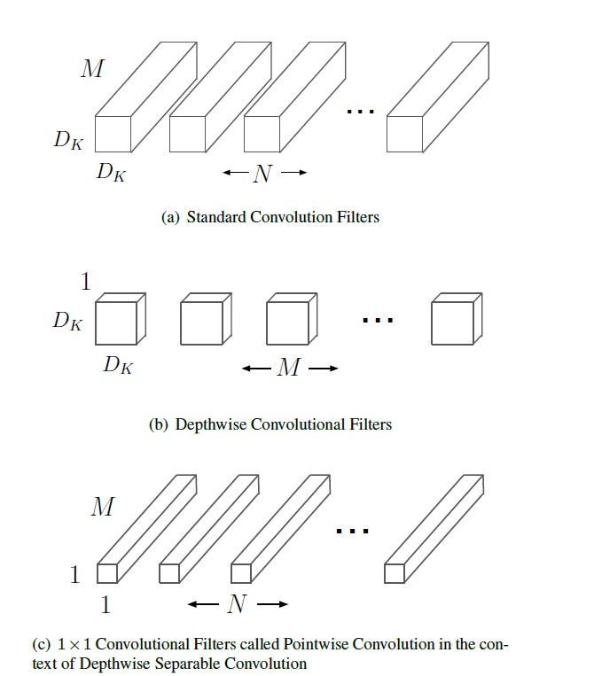

#### Code
```python
import torch
from light_cnns import mbv1
model = mbv1()
model.eval()
print(model)
input = torch.randn(1, 3, 224, 224)
y = model(input)
print(y.size())
```
<a name="mbv2"></a>  
#### MobileNetv2 网络模块
- [MobileNetV2: Inverted Residuals and Linear Bottlenecks](https://arxiv.org/abs/1801.04381)

mobilenetv2 沿用特征复用结构（残差结构），首先进行Expansion操作然后再进行Projection操作，最终构建一个逆残差网络模块（即Inverted residual block）。

- 增强了梯度的传播，显著减少推理期间所需的内存占用。
- 使用 RELU6（最高输出为 6）激活函数，使得模型在低精度计算下具有更强的鲁棒性。
- 在经过projection layer转换到低维空间后，将第二个pointwise convolution后的 ReLU6改成Linear结构，保留了特征多样性，增强网络的表达能力（Linear Bottleneck）


#### Code
```python
import torch
from light_cnns import mbv2
model = mbv2()
model.eval()
print(model)
input = torch.randn(1, 3, 224, 224)
y = model(input)
print(y.size())
```

<a name="mbv3"></a>  
#### MobileNetV3 网络模块

Searching for MobileNetV3
- 论文地址：https://arxiv.org/abs/1905.02244

核心改进点：
- 网络的架构基于NAS实现的MnasNet（效果比MobileNetV2好）  
- 论文推出两个版本：Large 和 Small，分别适用于不同的场景;
- 继承了MobileNetV1的深度可分离卷积  
- 继承了MobileNetV2的具有线性瓶颈的倒残差结构  
- 引入基于squeeze and excitation结构的轻量级注意力模型(SE)  
- 使用了一种新的激活函数h-swish(x)  
- 网络结构搜索中，结合两种技术：资源受限的NAS（platform-aware NAS）与NetAdapt 算法获得卷积核和通道的最佳数量
- 修改了MobileNetV2网络后端输出head部分;


#### Code
```python
import torch
from light_cnns import mbv3_small
#from light_cnns import mbv3_large
model_small = mbv3_small()
#model_large = mbv3_large()
model_small.eval()
print(model_small)
input = torch.randn(1, 3, 224, 224)
y = model_small(input)
print(y.size())
```

<a name="mbnext"></a>  
#### MobileNeXt 网络模块

- [Rethinking Bottleneck Structure for Efficient Mobile Network Design](https://arxiv.org/abs/2007.02269)

针对MobileNetV2的核心模块逆残差模块存在的问题进行了深度分析，提出了一种新颖的SandGlass模块，它可以轻易的嵌入到现有网络架构中并提升模型性能。Sandglass Block可以保证更多的信息从bottom层传递给top层，进而有助于梯度回传；执行了两次深度卷积以编码更多的空间信息。


#### Code
```python
import torch
from light_cnns import mobilenext
model = mobilenext()
model.eval()
print(model)
input = torch.randn(1, 3, 224, 224)
y = model(input)
print(y.size())
```

<a name="ShuffleNet"></a>
#### ShuffleNet
- [ShuffleNetv1](#shffv1)
- [ShuffleNetV2](#shffv2)

<a name="shffv1"></a>  
#### ShuffleNetv1 网络模块

- [ShuffleNet: An Extremely Efficient Convolutional Neural Network for Mobile Devices](https://arxiv.org/abs/1707.01083)


#### Code
```python
import torch
from light_cnns import shufflenetv1
model = shufflenetv1()
model.eval()
print(model)
input = torch.randn(1, 3, 224, 224)
y = model(input)
print(y.size())
```

<a name="shffv2"></a>  
#### ShuffleNetv2 网络模块
- [ShuffleNet V2: Practical Guidelines for Efficient CNN Architecture Design](https://arxiv.org/abs/1807.11164v1)


#### Code
```python
import torch
from light_cnns import shufflenetv2
model = shufflenetv2()
model.eval()
print(model)
input = torch.randn(1, 3, 224, 224)
y = model(input)
print(y.size())
```

<a name="noah"></a>
### 华为诺亚方舟系列
- [AdderNet](#add)
- [GhostNet](#ghost)

<a name="add"></a>
#### AdderNet（加法网络)
- [AdderNet and its Minimalist Hardware Design for Energy-Efficient Artificial Intelligence](https://arxiv.org/abs/2101.10015)

一种几乎不包含乘法的神经网络。不同于卷积网络，本文使用L1距离来度量神经网络中特征和滤波器之间的相关性。
由于L1距离中只包含加法和减法，神经网络中大量的乘法运算可以被替换为加法和减法，从而大大减少了神经网络的计算代价。
此外，该论文还设计了带有自适应学习率的改进的梯度计算方案，以确保滤波器的优化速度和更好的网络收敛。
在CIFAR和ImageNet数据集上的结果表明AdderNet可以在分类任务上取得和CNN相似的准确率。


#### Code
```python
import torch
from light_cnns import resnet20
model = resnet20()
model.eval()
print(model)
input = torch.randn(1, 3, 224, 224)
y = model(input)
print(y.size())
```
<a name="ghost"></a>
#### GhostNet
- [GhostNet: More Features from Cheap Operations](https://arxiv.org/abs/1911.11907)

该论文提供了一个全新的Ghost模块，旨在通过廉价操作生成更多的特征图。基于一组原始的特征图，作者应用一系列线性变换，以很小的代价生成许多能从原始特征发掘所需信息的“幻影”特征图（Ghost feature maps）。该Ghost模块即插即用，通过堆叠Ghost模块得出Ghost bottleneck，进而搭建轻量级神经网络——GhostNet。在ImageNet分类任务，GhostNet在相似计算量情况下Top-1正确率达75.7%，高于MobileNetV3的75.2%


#### Code
```python
import torch
from light_cnns import ghostnet
model = ghostnet()
model.eval()
print(model)
input = torch.randn(1, 3, 224, 224)
y = model(input)
print(y.size())
```

<a name="attention"></a>
### 注意力系列

#### CANet
- [Coordinate Attention for Efficient Mobile Network Design](https://arxiv.org/abs/2103.02907)

针对如何有效提升移动网络的卷积特征表达能力以及通道注意力(如SE)机制能够有效建模通道间相关性但忽视了位置信息的问题，本文提出了一种新颖的注意力机制：Coordinate Attention，它通过提取水平与垂直方向的注意力特征图来建模通道间的长距离依赖关系，而且水平与垂直注意力还可以有效地提供精确的空间位置信息。


#### Code
```python
import torch
from light_cnns import mbv2_ca
model = mbv2_ca()
model.eval()
print(model)
input = torch.randn(1, 3, 224, 224)
y = model(input)
print(y.size())
```

#### ECANet

- ECA-Net: Efficient Channel Attention for Deep Convolutional Neural Networks

- 论文地址：https://arxiv.org/abs/1910.03151

ECANet是一种即插即用的轻量级通道注意力模块，可显著提高CNN性能！ECANet主要对SENet模块进行了一些改进，提出了一种不降维的局部跨信道交互策略（ECA模块）和自适应选择一维卷积核大小的方法，该模块只增加了少量的参数，却能获得明显的性能增益。通过对SENet中通道注意模块的分析，实验表明避免降维对于学习通道注意力非常重要，适当的跨信道交互可以在显著降低模型复杂度的同时保持性能。因此，作者提出了一种不降维的局部跨信道交互策略，该策略可以通过一维卷积有效地实现。进一步，作者又提出了一种自适应选择一维卷积核大小的方法，以确定局部跨通道信息交互的覆盖率。

**具体结构如下所示：**

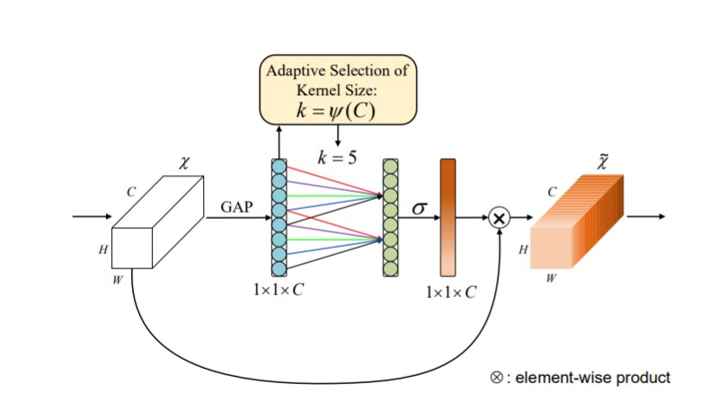


- 代码实现
```python
import torch
from light_cnns import mbv2_eca
model = mbv2_eca()
model.eval()
print(model)
input = torch.randn(1, 3, 224, 224)
y = model(input)
print(y.size())
```

#### ResNeSt

- ResNeSt: Split-Attention Networks

- 论文地址：https://hangzhang.org/files/resnest.pdf

ResNeSt 实际上是站在巨人们上的"集大成者"，特别借鉴了：Multi-path 和 Feature-map Attention思想。作者@张航也提到了这篇文章主要是基于 SENet，SKNet 和 ResNeXt，把 attention 做到 group level。另外还引入了Split-Attention块，可以跨不同的feature-map组实现feature-map注意力。和其它网络主要的区别在于：
1. GoogleNet 采用了Multi-path机制，其中每个网络块均由不同的卷积kernels组成。
2. ResNeXt在ResNet bottle模块中采用分组卷积，将multi-path结构转换为统一操作。 
3. SE-Net 通过自适应地重新校准通道特征响应来引入通道注意力（channel-attention）机制。 
4. SK-Net 通过两个网络分支引入特征图注意力（feature-map attention）。一句话总结就是用multiple scale feature汇总得到总的feature map information，然后利用Softmax来指导channel-wise的注意力向量从而实现自适应分配不同尺度的表征信息。

**网络结构如下：**

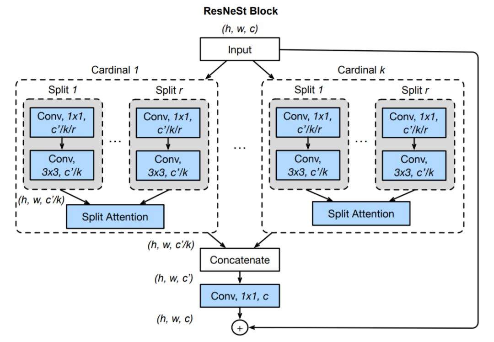


- 代码实现
```python
import torch
from light_cnns import resnest50_v1b
model = resnest50_v1b()
model.eval()
print(model)
input = torch.randn(1, 3, 224, 224)
y = model(input)
print(y.size())
```

#### SANet

- SA-Net: Shuffle Attention for Deep Convolutional Neural Networks

- 论文地址：https://arxiv.org/abs/2102.00240

shuffle attention主要在空间注意力（Spatial Attention）与通道注意力（Channel Attention）的基础上，引入了特征分组与通道注意力信息置换这两个操作，得到了一种超轻量型的即插即用注意力模块。具体的说，SA首先将输入沿着通道维度拆分为多组，然后对每一组特征词用Shuffle unit 刻画与建模特征在空间维度与通道维度上的依赖关系，最后所有特征进行集成以及通过通道置换操作进行各组件单元的特征通信。主要结构如下所示：

- 网络结构：


- 代码实现
```python
import torch
from light_cnns import mbv2_sa
model = mbv2_sa()
model.eval()
print(model)
input = torch.randn(1, 3, 224, 224)
y = model(input)
print(y.size())
```


#### Triplet attention
- Rotate to Attend: Convolutional Triplet Attention Module

- 论文地址：https://arxiv.org/abs/2010.03045

本文中主要提出了Triplet Attention，一种轻量且有效的注意力模块。该注意力机制是一种通过使用Triplet Branch结构捕获跨维度交互信息(cross dimension interaction)来计算注意力权重的新方法。对于输入张量，Triplet Attention通过旋转操作和残差变换建立维度间的依存关系，并以可忽略的计算开销对通道和空间信息进行编码。该方法既简单又有效，并且可以轻松地插入经典Backbone中。本文通过捕捉空间维度和输入张量通道维度之间的交互作用，显著提高了网络的性能.

- 网络结构


- 代码结构

```python
import torch
from light_cnns import mbv2_triplet
model = mbv2_triplet()
model.eval()
print(model)
input = torch.randn(1, 3, 224, 224)
y = model(input)
print(y.size())
```

<a name="cpu"></a>

### 移动端部署CPU网络架构
##### [移动端的最强轻量级网络架构来啦！ LCNet吊打现有主流轻量型网络（附代码实现）](https://zhuanlan.zhihu.com/p/437715954)

PP-LCNet: A Lightweight CPU Convolutional Neural Network
- 论文地址：https://arxiv.org/pdf/2109.15099.pdf

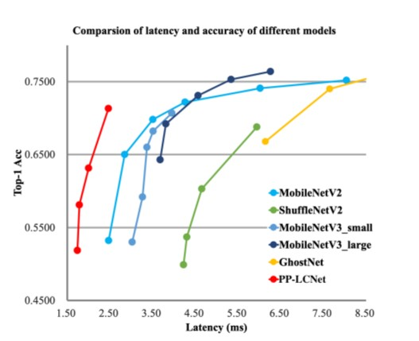

主要针对以下三个问题：
- 如何在不增加延迟的情况下促进网络学习到更强的表征能力？
- 目前有哪些要素可以在CPU上提高轻量级模型精度?
- 如何有效结合不同的策略（激活函数、注意力模块、各模块间的位置顺序等等）在CPU上设计出轻量级模型？


本文主要提出了LCNet轻量级网络架构，在不增加推理时间的情况下提高了精度，并且将这些策略有效地结合起来以获得更好的精度和速度之间的平衡。所提架构取得了比ShuffleNetV2、MobileNetV2、MobileNetV3以及GhostNet更优的延迟-精度均衡。

具体网络架构如下：


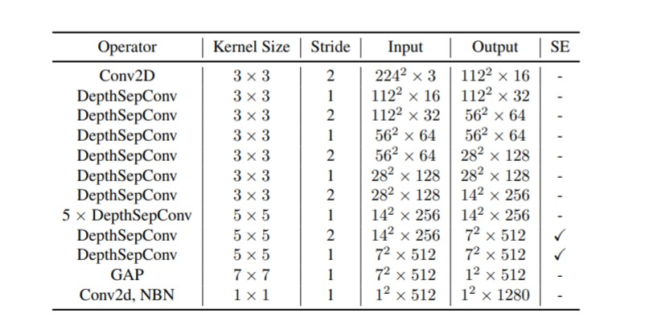

#### 代码实现如下：
```python
import torch
from light_cnns import lcnet_baseline
model = lcnet_baseline()
model.eval()
print(model)
input = torch.randn(1, 3, 224, 224)
y = model(input)
print(y.size())
```

<a name="vit"></a>​

### Transformer轻量级网络结构

MobileViT: 一种更小，更快,高精度的轻量级Transformer端侧网络架构

- 论文地址：https://arxiv.org/abs/2110.02178

本文提出的MobileViT网络架构旨在有效的结合CNN的归纳偏置优势和ViT的全局感受野能力，
它是一个轻量级，通用的，低时延的端侧网络架构。首先它利用了CNN中的空间归纳偏置优势以及对数据增强技巧的低敏感性的特性，
其次，它结合了ViT中对输入特征图信息进行自适应加权和建立全局依赖关系等优点。具体做法如下
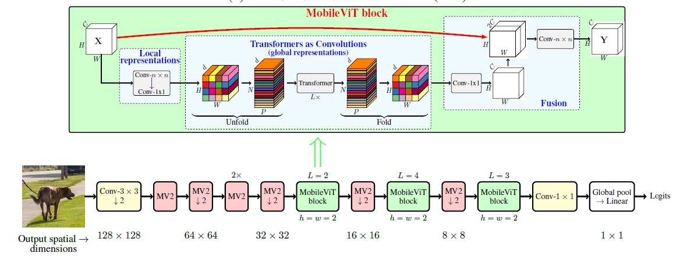

网络架构如下：
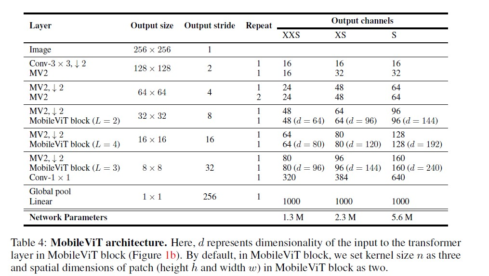

代码实现如下：
```python
import torch
from light_cnns import mobilevit_s
model = mobilevit_s()
model.eval()
print(model)
input = torch.randn(1, 3, 224, 224)
y = model(input)
print(y.size())
```

<a name="inception"></a>​
### Inception系列

#### Going Deeper with Convolutions (GoogleNet)
- 论文地址：https://arxiv.org/abs/1409.4842

1. 首先使用1x1的卷积来进行升降维，这样就巧妙地解决了针对采用较大的卷积核计算复杂度较大这一问题；
2. 然后再在多个不同尺度上运用不同大小的卷积核同时进行卷积，最后将特征进行聚合。

主要结构如下所示：


代码实现如下:
```python
import torch
from light_cnns import googlenet
model = googlenet()
model.eval()
print(model)
input = torch.randn(1, 3, 224, 224)
y = model(input)
print(y.size())

```
#### Rethinking the Inception Architecture for Computer Vision

- 论文地址：https://arxiv.org/abs/1512.00567

Inceptionv2针对InceptionV1改进的点主要有：

1. 引入了BN层来对中间特征进行归一化。使用BN层之后，可以加快收敛速度，防止模型出现过拟合.
2. 使用因子分解的方法，主要包括：将 5x5 的卷积分解为两个 3x3 的卷积运算以提升计算速度；将 nxn 的卷积核尺寸分解为 1xn 和 nx1 两个卷积.
3. 扩展模型的宽度，来有效地解决表征性瓶颈问题。

代码实现如下：

```python
import torch
from light_cnns import inception_v2
model = inception_v2()
model.eval()
print(model)
input = torch.randn(1, 3, 224, 224)
y = model(input)
print(y.size())

```

Inception Net v3 整合了前面 Inception v2 的特点，除此之外，还包括以下5点改进：

1. 不再直接使用max pooling层进行下采样，作者设计了另外一种方案，即两个并行的分支，一个是pooling层，另外一个卷积层，最后将两者结果concat在一起。这样在使用较小的计算量情形下还可以避免瓶颈层，ShuffleNet中也采用了这种策略。

2. 使用RMSProp 优化器；
3. Factorized 7x7 卷积；
4. 辅助分类器使用了 BatchNorm；
5. 使用了label smoothing;

代码实现如下：

```python
import torch
from light_cnns import inception_v3
model = inception_v3()
model.eval()
print(model)
input = torch.randn(1, 3, 224, 224)
y = model(input)
print(y.size())
```

#### Inception-v4, Inception-ResNet and the Impact of Residual Connections on Learning
- 论文地址：https://arxiv.org/abs/1602.07261

1. Inception v4 引入了一个新的stem模块，该模块放在Inception块之间执行。
2. 基于新的stem和Inception 模块，Inception v4重新提出了三种新的Inception模块分别称为 A、B 和 C
3. 引入了专用的「缩减块」（reduction block），它被用于改变网格的宽度和高度。

```python
import torch
from light_cnns import inception_v4
model = inception_v4()
model.eval()
print(model)
input = torch.randn(1, 3, 224, 224)
y = model(input)
print(y.size())
```

#### Xception: Deep Learning with Depthwise Separable Convolutions

论文地址：https://arxiv.org/abs/1610.02357

基于Inception的模块，一个新的架构Xception应运而生。Xception取义自Extreme Inception，
即Xception是一种极端的Inception.它的提出主要是为了解耦通道相关性和空间相关性。Xception主要通过提出深度可分离卷积则成功实现了将学习空间相关性和学习通道间相关性的任务完全分离，具体操作如下：

1. 将Inception模块简化，仅保留包含3x3的卷积的分支：
2. 将所有1x1的卷积进行拼接.
3. 进一步增加3x3的卷积的分支的数量，使它与1x1的卷积的输出通道数相等：
4. 此时每个3x3的卷积即作用于仅包含一个通道的特征图上，作者称之为“极致的Inception（Extream Inception）”模块，这就是Xception的基本模块。事实上，调节每个3x3的卷积作用的特征图的通道数，
即调节3x3的卷积的分支的数量与1x1的卷积的输出通道数的比例，可以实现一系列处于传统Inception模块和“极致的Inception”模块之间的状态。

代码实现如下：
```python
import torch
from light_cnns import xception
model = xception()
model.eval()
print(model)
input = torch.randn(1, 3, 224, 224)
y = model(input)
print(y.size())
```

#### Inception Convolution with Efficient Dilation Search（CVPR2021 oral）

- 论文地址：https://arxiv.org/abs/2012.13587

为了充分挖掘空洞卷积的潜力，本文主要结合一种基于统计优化的简单而高效(零成本)的空洞搜索算法（EDO，effective dilation search）提出了一种新的空洞卷积变体，即inception (dilated)卷积

网络结构如下所示：

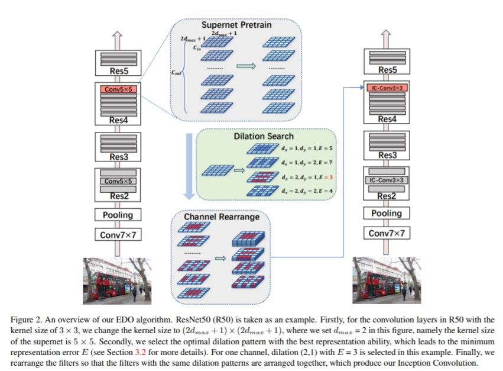

代码实现如下：
```python
import torch
from light_cnns import ic_resnet50
patter = './pattern_zoo/detection/ic_resnet50_k9.json'
model = ic_resnet50(pattern_path=patter)
model.eval()
print(model)
input = torch.randn(1, 3, 224, 224)
y = model(input)
print(y.size())
```


<a name="seg"></a>​
### 轻量级图像分割网络架构

#### [ESPNet系列：自动驾驶领域轻量级分割模型]()

ESPNet: Efficient Spatial Pyramid of Dilated Convolutions for Semantic Segmentation

- 论文地址：https://arxiv.org/abs/1803.06815v2

ESPNet是用于语义分割的轻量级网络，主要提出一种高效空间金字塔卷积模块（ESP Module），该模块包含point-wise卷积和空洞卷积金字塔,有助于减小模型运算量和内存、功率消耗，以提高在终端设备上的适用性。综合比较，ESPNet能在GPU/笔记本/终端设备上达到112FPS/21FPS/9FPS。


网络架构如下：

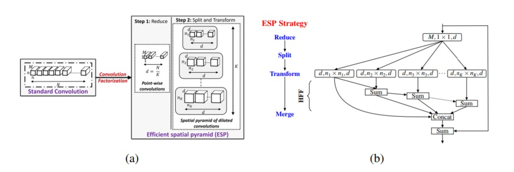

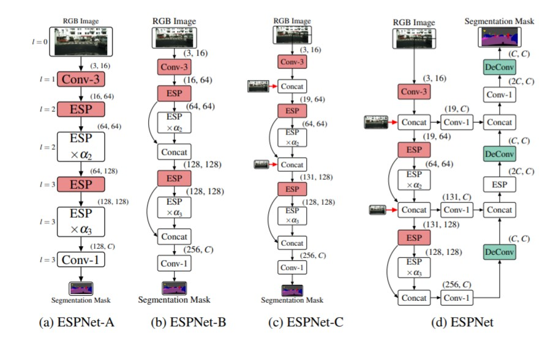


代码实现如下：
```python
import torch
from light_cnns import espnetv1
model = espnetv1()
model.eval()
print(model)
input = torch.randn(1, 3, 224, 224)
y = model(input)
print(y.size())
```

#### ESPNetv2: A Light-weight, Power Efficient, and General Purpose Convolutional Neural Network

ESPNetv2主要基于ESPNetv1进行了模型轻量化处理，主要包括：

1. 基于深度可分离空洞卷积以及分组point-wise卷积改进ESP模块，提出了EESP(Extremely Efficient Spatial Pyramid)模块。相对于ESPNet拥有更好的精度以及更少的参数。

2. 设计了cyclic learning rate scheduler，比一般的固定学习率的scheduler要好。


其中下采样版本的EESP模块(Strided EESP with shortcut connection to an input image),如下图所示：

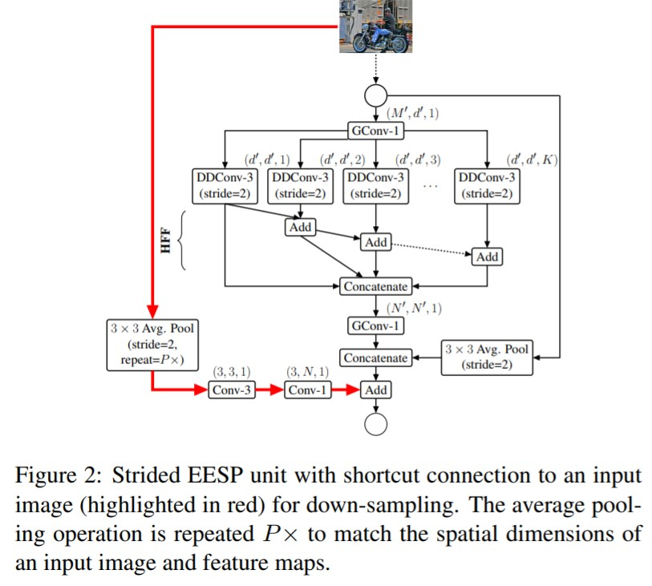

网络架构如下：


代码实现如下：
```python
import torch
from light_cnns import espnetv2
model = espnetv2()
model.eval()
print(model)
input = torch.randn(1, 3, 224, 224)
y = model(input)
print(y.size())
```

