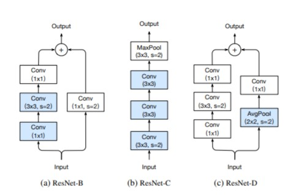
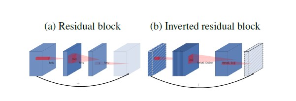
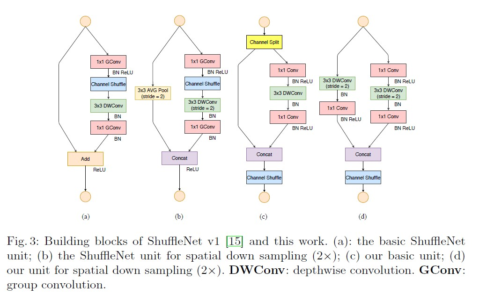
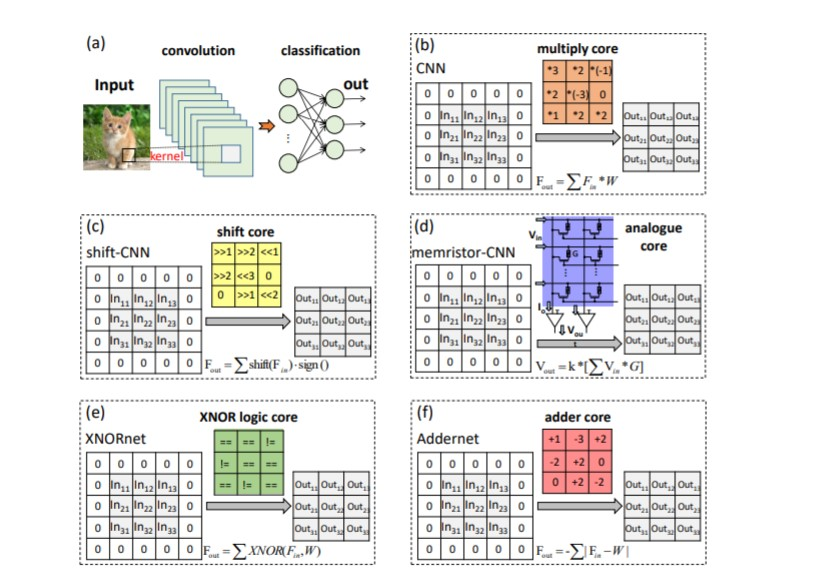
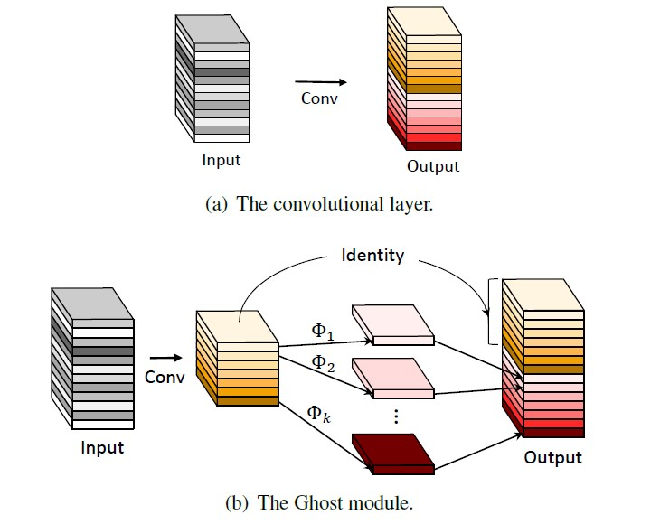
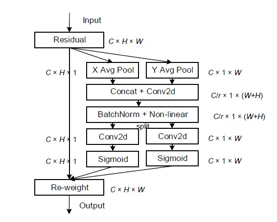

# awesome_lightweight_networks


[](https://github.com/murufeng/awesome_lightweight_networks)
[](https://github.com/murufeng/awesome_lightweight_networks)


目前在深度学习领域主要分为两类，一派为学院派(Researcher)，研究强大、复杂的模型网络和实验方法，旨在追求更高的性能；
另一派为工程派(Engineer)，旨在将算法更稳定、更高效的落地部署在不同硬件平台上。

因此，针对这些移动端的算力设备，如何去设计一种高效且精简的网络架构就显得尤为重要。从2017年以来，已出现了很多优秀实用的轻量级网络架构，
但是还没有一个通用的项目把这些网络架构进行集成起来。**本项目可以作为一个即插即用的工具包，通过直接调用就可以直接训练各种类型的网络**。

目前该项目暂时支持在Cifar10/100,ImageNet数据集上进行实验。**后续会持续针对每个不同的具体任务，更新工业界比较实用的SOTA的网络架构模型**。

本项目主要提供一个移动端网络架构的基础性工具，避免重复造轮子，后续我们将针对具体视觉任务集成更多的网络架构。希望本项目既能**让深度学习初学者快速入门**，又能**服务科研和工业社区**。

（欢迎各位轻量级网络科研学者将自己工作的核心代码整理到本项目中，推动科研社区的发展，我们会在readme中注明代码的作者~）

## Table of Contents
### [MobileNets系列](#MobileNet)
  
### [ShuffleNet系列](#ShuffleNet)

### [华为诺亚轻量级网络系列](#noah)

### [轻量级注意力网络架构](#attention)

### [Transformer轻量级网络结构](#vit)

### [移动端部署CPU网络架构](#cpu)

### [CondenseNet系列](#condense)

### [轻量级检测网络结构](#det)

### [轻量级图像分割网络架构](#seg)

### [轻量级图像去噪网络架构](#denoise)

### [轻量级图像超分网络架构](#super)

### [轻量级人体姿态估计网络架构](#hrnet)

### [轻量级的卷积操作](#conv)

### [模型压缩方法汇总](#compress)

### [Bag of Tricks for Image Classification with Convolutional Neural Networks](https://arxiv.org/abs/1812.01187v2)

#### 网络结构


#### Code

```python
import torch
from light_cnns import resnet50_v1b
model = resnet50_v1b()
model.eval()
print(model)
input = torch.randn(1, 3, 224, 224)
y = model(input)
print(y.size())
```

<a name="MobileNet"></a>
### MobileNets系列
本小节主要汇总了基于Google 提出来的适用于手机端的网络架构MobileNets的系列改进，针对每个网络架构，将主要总结每个不同模型的核心创新点，模型结构图以及代码实现.
   - [MobileNetV1](#mbv1)
   - [MobileNetV2](#mbv2)
   - [MobileNetV3](#mbv3)
   - [MobileNeXt](#mbnext)

<a name="mbv1"></a>  
#### MobileNetv1 网络模块

- [MobileNets: Efficient Convolutional Neural Networks for Mobile Vision Applications](https://arxiv.org/abs/1704.04861)
MobileNetv1模型是Google针对移动端设备提出的一种轻量级的卷积神经网络，其使用的核心思想便是depthwise separable convolution（深度可分离卷积）。具体结构如下所示：


#### Code
```python
import torch
from light_cnns import mbv1
model = mbv1()
model.eval()
print(model)
input = torch.randn(1, 3, 224, 224)
y = model(input)
print(y.size())
```
<a name="mbv2"></a>  
#### MobileNetv2 网络模块
- [MobileNetV2: Inverted Residuals and Linear Bottlenecks](https://arxiv.org/abs/1801.04381)

mobilenetv2 沿用特征复用结构（残差结构），首先进行Expansion操作然后再进行Projection操作，最终构建一个逆残差网络模块（即Inverted residual block）。

- 增强了梯度的传播，显著减少推理期间所需的内存占用。
- 使用 RELU6（最高输出为 6）激活函数，使得模型在低精度计算下具有更强的鲁棒性。
- 在经过projection layer转换到低维空间后，将第二个pointwise convolution后的 ReLU6改成Linear结构，保留了特征多样性，增强网络的表达能力（Linear Bottleneck）



#### Code
```python
import torch
from light_cnns import mbv2
model = mbv2()
model.eval()
print(model)
input = torch.randn(1, 3, 224, 224)
y = model(input)
print(y.size())
```

<a name="mbv3"></a>  
#### MobileNetV3 网络模块

Searching for MobileNetV3
- 论文地址：https://arxiv.org/abs/1905.02244

核心改进点：
- 网络的架构基于NAS实现的MnasNet（效果比MobileNetV2好）  
- 论文推出两个版本：Large 和 Small，分别适用于不同的场景;
- 继承了MobileNetV1的深度可分离卷积  
- 继承了MobileNetV2的具有线性瓶颈的倒残差结构  
- 引入基于squeeze and excitation结构的轻量级注意力模型(SE)  
- 使用了一种新的激活函数h-swish(x)  
- 网络结构搜索中，结合两种技术：资源受限的NAS（platform-aware NAS）与NetAdapt 算法获得卷积核和通道的最佳数量
- 修改了MobileNetV2网络后端输出head部分;


#### Code
```python
import torch
from light_cnns import mbv3_small
#from light_cnns import mbv3_large
model_small = mbv3_small()
#model_large = mbv3_large()
model_small.eval()
print(model_small)
input = torch.randn(1, 3, 224, 224)
y = model_small(input)
print(y.size())
```

<a name="mbnext"></a>  
#### MobileNeXt 网络模块

- [Rethinking Bottleneck Structure for Efficient Mobile Network Design](https://arxiv.org/abs/2007.02269)

针对MobileNetV2的核心模块逆残差模块存在的问题进行了深度分析，提出了一种新颖的SandGlass模块，它可以轻易的嵌入到现有网络架构中并提升模型性能。Sandglass Block可以保证更多的信息从bottom层传递给top层，进而有助于梯度回传；执行了两次深度卷积以编码更多的空间信息。


#### Code
```python
import torch
from light_cnns import mobilenext
model = mobilenext()
model.eval()
print(model)
input = torch.randn(1, 3, 224, 224)
y = model(input)
print(y.size())
```

<a name="ShuffleNet"></a>
#### ShuffleNet
- [ShuffleNetv1](#shffv1)
- [ShuffleNetV2](#shffv2)

<a name="shffv1"></a>  
#### ShuffleNetv1 网络模块

- [ShuffleNet: An Extremely Efficient Convolutional Neural Network for Mobile Devices](https://arxiv.org/abs/1707.01083)


#### Code
```python
import torch
from light_cnns import shufflenetv1
model = shufflenetv1()
model.eval()
print(model)
input = torch.randn(1, 3, 224, 224)
y = model(input)
print(y.size())
```

<a name="shffv2"></a>  
#### ShuffleNetv2 网络模块
- [ShuffleNet V2: Practical Guidelines for Efficient CNN Architecture Design](https://arxiv.org/abs/1807.11164v1)



#### Code
```python
import torch
from light_cnns import shufflenetv2
model = shufflenetv2()
model.eval()
print(model)
input = torch.randn(1, 3, 224, 224)
y = model(input)
print(y.size())
```

<a name="noah"></a>
### 华为诺亚方舟系列
- [AdderNet](#add)
- [GhostNet](#ghost)

<a name="add"></a>
#### AdderNet（加法网络)
- [AdderNet and its Minimalist Hardware Design for Energy-Efficient Artificial Intelligence](https://arxiv.org/abs/2101.10015)



#### Code
```python
import torch
from light_cnns import resnet20
model = resnet20()
model.eval()
print(model)
input = torch.randn(1, 3, 224, 224)
y = model(input)
print(y.size())
```
<a name="ghost"></a>
#### GhostNet
- [GhostNet: More Features from Cheap Operations](https://arxiv.org/abs/1911.11907)


#### Code
```python
import torch
from light_cnns import ghostnet
model = ghostnet()
model.eval()
print(model)
input = torch.randn(1, 3, 224, 224)
y = model(input)
print(y.size())
```

<a name="attention"></a>
### 注意力系列

#### CANet
- [Coordinate Attention for Efficient Mobile Network Design](https://arxiv.org/abs/2103.02907)



#### Code
```python
import torch
from light_cnns import mbv2_ca
model = mbv2_ca()
model.eval()
print(model)
input = torch.randn(1, 3, 224, 224)
y = model(input)
print(y.size())
```


